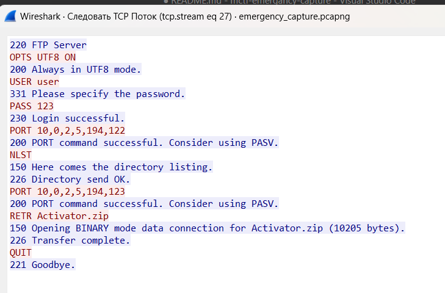

# mctf-emergancy-capture
Misc task for [M*CTF](https://mctf.mtuci.ru) Finals 

## Описание
Наши сенсоры зафиксировали атаку на рабочую станцию в сети. 
Найдите файлы, которые, могли быть похищены.

## Решение
Лучше всего начать с открытия пункта Статистика -> Иерархия адресов.
Помимо кучи интернет-адресов у нас есть 4 из одной сети. Их и проверим


### 10.0.2.3
**10.0.2.3** - это DHCP сервер и от него прилетело всего 2 пакета, не интересно


### 10.0.2.15
Дальше по колличеству пакетов идёт **10.0.2.15** . 


Здесь видно FTP соединение с **10.0.2.5**, посмотрим его (ПКМ->Follow TCP Stream)



Был скачан некий файл с названием *Activator.zip*. Предположим, что **10.0.2.5** - это рабочая станция. У неё очень много соединений, потому рациональнее перейти к **10.0.2.6**.

### 10.0.2.6
Сразу выберем в качестве источника **10.0.2.5**, a в качестве назначения **10.0.2.6**. Здесь какая-то TCP сессия.


Сразу откроем TCP поток. 


А здесь у нас лог обратной оболочки с **10.0.2.6**. В нём был прочитан файл secret.txt. Секрет в нём похож на флаг, который нужно "повернуть".

С помощью [Cyberchef](https://gchq.github.io/CyberChef/) и опции ROT13 Bruteforce (чтобы не подбирать по одному) расшифровываем флаг.


## Flag 
```
MCTF{St0l3n_sHe1l}
```
